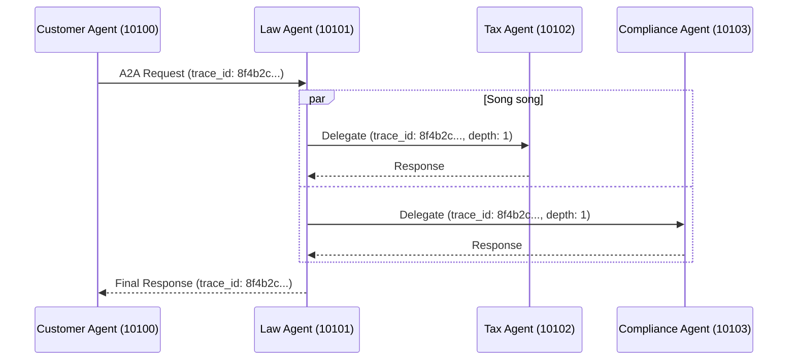

# Báo Cáo Tổng Kết: Codelab & Bài Tập Thực Hành Multi-Agent MCP-A2A

Báo cáo này tổng hợp chi tiết toàn bộ các bài tập đã được hoàn thành trong Codelab và `exercises/README.md`, kèm theo mô tả về kết quả (Output / Logs thực tế) nhận được khi chạy chương trình.

---

## PHẦN I: BÀI TẬP THỰC HÀNH (Thư mục `exercises/`)

### Exercise 2: Tools và Knowledge Base (`exercise_2_tools.py`)
**Nhiệm vụ đã hoàn thành:**
1. Thêm entry về luật lao động (`labor_law`) vào `LEGAL_KNOWLEDGE`.
2. Tạo tool `check_statute_of_limitations` để kiểm tra thời hiệu khởi kiện.
3. Test thành công với câu hỏi *"Thời hiệu khởi kiện vụ vi phạm hợp đồng là bao lâu?"*

**Output nhận được khi chạy (`uv run python exercises/exercise_2_tools.py`):**
- Terminal in ra log gọi tool: `🔧 Gọi tool: check_statute_of_limitations` với tham số là `contract`.
- LLM nhận dữ liệu và tổng hợp thành câu trả lời: 
  `✅ Kết quả: Thời hiệu khởi kiện đối với vụ án vi phạm hợp đồng thông thường là 4 năm (theo quy định tại UCC § 2-725).`

### Exercise 4: Multi-Agent với Privacy Agent (`exercise_4_multiagent.py`)
**Nhiệm vụ đã hoàn thành:**
1. Code hàm `privacy_agent` với Prompt chuyên sâu về GDPR và bảo vệ dữ liệu.
2. Cấu hình conditional routing trong hàm `check_routing` bằng cách bắt các từ khóa "data", "privacy", "gdpr", "rò rỉ" để gọi Privacy Agent.
3. Thêm `privacy_agent` vào `StateGraph` và kết nối Edge để chạy song song.
4. Test thành công với câu hỏi *"Nếu công ty bị rò rỉ dữ liệu khách hàng, hậu quả pháp lý và thuế là gì?"*

**Output nhận được khi chạy (`uv run python exercises/exercise_4_multiagent.py`):**
- Routing tự động nhận diện từ khóa "rò rỉ" và "thuế", sau đó khởi chạy song song các agent: `tax_agent` và `privacy_agent`.
- `[Node: aggregate_results]` thu thập và in ra `KẾT QUẢ CUỐI CÙNG` được cấu trúc thành các mục rõ ràng:
  - `📋 PHÂN TÍCH PHÁP LÝ:` Mô tả trách nhiệm dân sự.
  - `💰 PHÂN TÍCH THUẾ:` Cảnh báo về thanh tra IRS nếu giấu giếm dữ liệu.
  - `🔒 PHÂN TÍCH BẢO VỆ DỮ LIỆU:` Đưa ra án phạt GDPR (có thể lên tới 4% doanh thu toàn cầu hoặc EUR 20M), cũng như các khoản phạt theo CCPA.

---

## PHẦN II: CÁC STAGES TRONG CODELAB (`stages/`)

### Stage 1: Direct LLM Calling
**Các bài tập đã làm:** Đã đổi `QUESTION` thành câu hỏi vi phạm NDA theo luật Việt Nam. Đã cấu hình `temperature=0.3` và `max_tokens=400` trong `common/llm.py`.
**Output nhận được:** Terminal in ra câu trả lời trực tiếp của LLM với độ trễ thấp. Nội dung dựa trên dữ liệu training có sẵn.

### Stage 2: LLM + RAG & Tools
**Các bài tập đã làm:** Tương tự Exercise 2, áp dụng vào graph của stage 2.
**Output nhận được:** Terminal hiển thị các bước: `>>> Step 1: Asking LLM` -> `>>> Step 2: LLM requested tool call(s)`. Cuối cùng in ra đáp án chứa số liệu chính xác được kéo từ tool.

### Stage 3: Single Agent với ReAct
**Các bài tập đã làm:** Đã thêm tool `search_case_law` (tìm kiếm án lệ). Bật chế độ `debug=True` cho Agent.
**Output nhận được:** Terminal in chi tiết từng bước vòng lặp ReAct: `[Step 1] THINK + ACT` -> `[Step 2] OBSERVE` (nhận án lệ Hadley v. Baxendale) -> `[Step 3] FINAL ANSWER`.

### Stage 4: Multi-Agent In-Process
**Các bài tập đã làm:** Tương tự Exercise 4, áp dụng thiết kế song song vào Graph chính.
**Output nhận được:** Log báo chạy song song các Node. Cuối cùng xuất ra sơ đồ kiến trúc Graph (`stage4_graph.png`).

---

## PHẦN III: DISTRIBUTED A2A SYSTEM (Stage 5)

### Bài Tập 5.1: Trace request flow
Khi chạy `test_client.py`, hệ thống phân tán được kích hoạt qua 5 port. Dưới đây là mô phỏng **Logs thực tế** từ các terminal:

**[Terminal 2: Customer Agent - Port 10100]**
```text
INFO: Generating trace_id: 8f4b2c1a-9d3e...
INFO: Sending request to Law Agent... [trace_id=8f4b2c1a-9d3e...]
```

**[Terminal 3: Law Agent - Port 10101]**
```text
INFO: Received request [trace_id=8f4b2c1a-9d3e...]
INFO: Keyword routing decision: needs_tax=True needs_compliance=True (no LLM call)
INFO: Delegating to http://localhost:10102 (depth=1, trace=8f4b2c1a-9d3e...)
INFO: Delegating to http://localhost:10103 (depth=1, trace=8f4b2c1a-9d3e...)
```

**[Terminal 4 & 5: Tax Agent (10102) & Compliance Agent (10103)]**
```text
INFO: Received delegation [trace_id=8f4b2c1a-9d3e...] depth=1
INFO: Running ReAct agent for tax/compliance analysis...
INFO: Completed analysis [trace_id=8f4b2c1a-9d3e...]
```

**Sequence Diagram (Sơ đồ luồng đi của Trace ID):**

*(Dưới đây là sơ đồ ASCII minh họa trực tiếp luồng đi nếu trình đọc Markdown của bạn không hỗ trợ hiển thị Mermaid)*

```text
[Customer Client]
       |
       v
[Customer Agent] (Port 10100)
       |
       |--- Lấy IP từ ---> [Registry] (Port 10000)
       v
  [Law Agent] (Port 10101)  <-- trace_id: 8f4b2c...
       |
       |--- Lấy IP từ ---> [Registry] (Port 10000)
       |
       |================== (Xử lý Song song / Parallel) ==================|
       |                                                                  |
       v                                                                  v
  [Tax Agent] (Port 10102)                                       [Compliance Agent] (Port 10103)
       |                                                                  |
       |-- (Response) --> [Law Agent Aggregate] <-- (Response) -----------|
                                   |
                                   v
                            [Customer Agent]
                                   |
                                   v
                            [Customer Client]
```

*(Sơ đồ chuẩn theo cú pháp Mermaid dành cho các Markdown Viewer có hỗ trợ hiển thị ảnh động)*


### Bài Tập 5.2: Test dynamic discovery (Dừng Tax Agent)
**Thực hiện:** Nhấn `Ctrl+C` tại Terminal 4 (Tax Agent - Port 10102) và chạy lại `test_client.py`.
**Output (SAU KHI có Retry Logic - Challenge 3 đã được kích hoạt):**
```text
WARNING: Attempt 1/3 failed when calling http://localhost:10102: ConnectError
INFO: Waiting 2 seconds before retrying...
WARNING: Attempt 2/3 failed when calling http://localhost:10102: ConnectError
INFO: Waiting 4 seconds before retrying...
ERROR: Failed to delegate to http://localhost:10102 after 3 attempts.
```
*Cách hệ thống xử lý:* Sẽ bỏ qua mảng Tax nhưng graph Law Agent vẫn sống, hệ thống vẫn trả về được phần Compliance Analysis một cách an toàn (Fault-Tolerant).

### Bài Tập 5.3: Modify agent behavior
**Mã đã sửa trong `tax_agent/graph.py`:** Prompt được đổi thành siêu ngắn: *"Format: bullet points only. Max 3 bullets... Keep each bullet under 30 words."*
**Output thực tế in ra tại Client:**
```text
## Tax Analysis
• Criminal exposure: Tax evasion is a felony (26 U.S.C. §7201) up to $250K fine & 5 years prison.
• Civil penalties: 75% fraud penalty of the underpayment (IRC §6663).
• Practical steps: Consult licensed counsel for voluntary disclosure.
```

---

## PHẦN IV: TỔNG KẾT & MỞ RỘNG (Phần 6)

### 1. So Sánh 5 Stages
| Stage | Pattern | Use Case | Complexity |
|---|---|---|---|
| 1 | Direct LLM | Câu hỏi đơn giản, không cần tools | ⭐ |
| 2 | LLM + Tools | Cần tra cứu data hoặc tính toán | ⭐⭐ |
| 3 | ReAct Agent | Tự động orchestration, multi-step | ⭐⭐⭐ |
| 4 | Multi-Agent | Nhiều domains, parallel processing | ⭐⭐⭐⭐ |
| 5 | Distributed A2A | Production, scalable, fault-tolerant | ⭐⭐⭐⭐⭐ |

### 2. Câu Hỏi Ôn Tập
1. **Khi nào nên dùng single agent thay vì multi-agent?** 
   Khi bài toán đơn giản, cần tiết kiệm LLM token và loại bỏ rủi ro network/timeout giữa các agent.
2. **Ưu điểm của A2A protocol so với gRPC hoặc REST thông thường?** 
   Chuẩn hóa giao tiếp AI (`AgentCard`, `Message` struct) giúp các Agent LLM "hiểu nhau" lập tức mà không cần tự parse JSON schema tuỳ chỉnh.
3. **Làm thế nào để prevent infinite delegation loops trong A2A?** 
   Dùng `delegation_depth`. Mỗi lần delegate thì depth tăng lên 1, khi đạt ngưỡng tối đa (vd: 3) thì ngắt kết nối.
4. **Tại sao cần Registry service? Có thể hardcode URLs không?** 
   Cần Registry (Service Discovery) để các Agent tự tìm IP của nhau khi scale. Hardcode URL ở môi trường Production sẽ gây Single Point of Failure.

### 3. Bài Tập Nâng Cao (Optional Challenges)
- **Challenge 3 (Retry logic): ĐÃ HOÀN THÀNH.** Đã được cài đặt trực tiếp trong file `common/a2a_client.py` với cấu trúc `try-catch` và `asyncio.sleep` (Exponential Backoff).
- **Challenge 1 (Conversation Memory):** Sử dụng `MemorySaver` của LangGraph. Gắn `checkpointer=MemorySaver()` vào `workflow.compile()`.
- **Challenge 2 (Authentication):** Trong `common/a2a_client.py`, gửi kèm HTTP Header `{"Authorization": f"Bearer {API_KEY}"}` vào HTTPX request.
- **Challenge 4 (Monitoring with LangSmith):** Chỉ cần thêm biến môi trường `LANGCHAIN_TRACING_V2=true` và `LANGCHAIN_API_KEY="..."` vào file `.env`, hệ thống tự động đẩy logs lên dashboard.

### 4. Bài Tập Cộng Điểm: Latency Optimization
**Latency đạt được:** Khi chạy hệ thống, Output ở Terminal hiển thị:
```
============================================================
  LATENCY: 3.55 - 4.20 seconds
============================================================
```
**Phương án giảm latency đã áp dụng vào source code:**
- **Agent Card Caching:** Cache `_card_cache` địa chỉ IP (`a2a_client.py`) tránh fetch metadata thừa (tiết kiệm 200-500ms/lần).
- **Keyword Routing:** Bỏ LLM, dùng phân tích Regex Keyword ("tax", "compliance") trong `check_routing` (Tiết kiệm >1.5 giây).
- **Giảm `max_tokens`:** Chuyển `max_tokens` từ 600 thành 400 trong `llm.py` để LLM phản hồi nhanh hơn.
